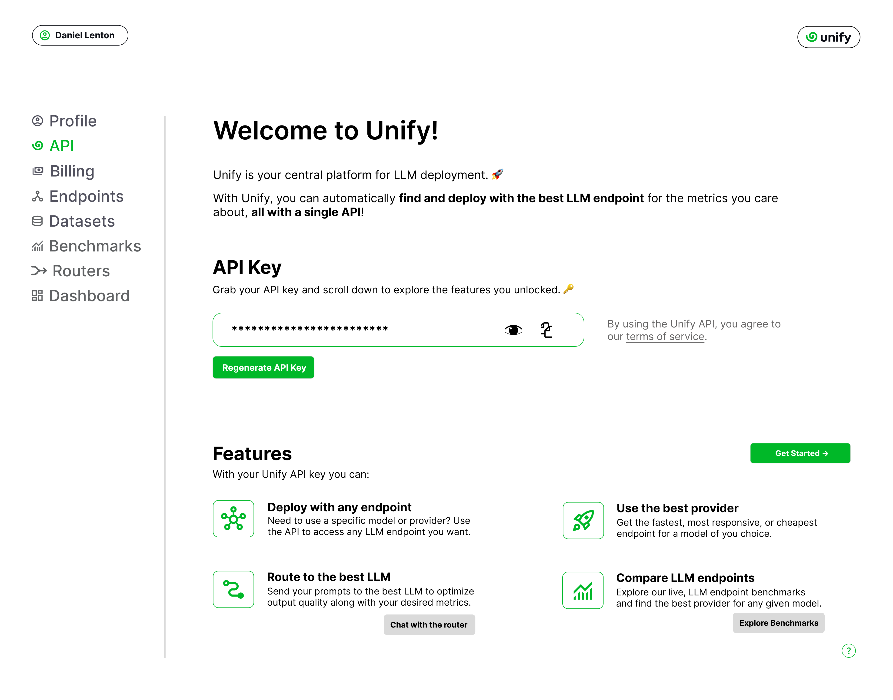

Making your first request
=========================

In this section, you will learn how to use the Unify API to query and route across LLM endpoints. If you haven't done so already, start by :code:`Signing Up` through the `Unify Console <https://console.unify.ai>`_ to get your API key.

Getting a key
-------------

When opening the console, you will first be greeted with the :code:`API` page. This is where you'll find your API key. There, you will also find useful links to our interfaces, where you can interact with the endpoints and the benchmarks, in no-code environments.

.. note::
    If you suspect your API key was leaked in some way, you can safely regenerate it through this page. You would then only need to replace the old key with the new one in your workflows with the same balance and account settings as before.

Finding a model and provider
----------------------------

To query an endpoint you will need to specify the model Id and provider Id, both used to identify the endpoint. You can find the Ids for a given model and provider through the model pages on the `benchmark interface. <https://unify.ai/benchmarks>`_

Going through one of the pages, the model Id can be copied from the model name at the top, and the provider Id can be copied from the corresponding rows on the table. For e.g, the model page for **Mistral 7B V2** below shows that the model Id is :code:`mistral-7b-instruct-v0.2`. If you wanted to query the **Fireworks AI** endpoint you would then use :code:`fireworks-ai` as the provider name.

.. image:: ../images/benchmarks_model_page.png
  :align: center
  :width: 650
  :alt: Benchmarks Model Page.

.. note::
    If you `uploaded a custom endpoint <https://unify.ai/docs/interfaces/connecting_stack.html#custom_endpoint>`_ then you should be able to query it through the API using the name as the model Id and the provider name as the provider Id. 

Querying an endpoint
--------------------

Using the Python Package
^^^^^^^^^^^^^^^^^^^^^^^^

The easiest way to use the Unify API is through the `unifyai <https://pypi.org/project/unifyai/>`_ Python package.  You can install it by doing:

.. code-block:: bash

    pip install unifyai

To use it in your script, import the package and initialize a :code:`Unify` client with your :code:`UNIFY API KEY`. You can then query any endpoint through the :code:`.generate` method. To specify the endpoint, you can use the model and provider Ids from above. 

.. code-block:: python

    import os
    from unify import Unify

    # Assuming you added "UNIFY_KEY" to your environment variables. Otherwise you would specify the api_key argument.
    unify = Unify("mistral-7b-instruct-v0.2@fireworks-ai")

    response = unify.generate("Explain who Newton was and his entire theory of gravitation. Give a long detailed response please and explain all of his achievements")

This will return a string containing the model's response.

.. note::
    The Python package also lets you access the list of models and providers for a given model with a couple lines of code. You just need to run
    :code:`unify.list_models()` to get a list of models and :code:`unify.list_providers("mistral-7b-instruct-v0.2")` to get the providers for a given model.

In addition, the Python package supports both synchronous and asynchronous clients, as well as streaming responses. Check out the `package repo <https://github.com/unifyai/unify-llm-python?tab=readme-ov-file#unify-python-api-library>`_ to learn more!

Using the :code:`inference` Endpoint
^^^^^^^^^^^^^^^^^^^^^^^^^^^^^^^^^^^^

All models can be queried through the :code:`inference` endpoint, which also requires a :code:`model` Id, :code:`provider` Id, and model :code:`arguments` that may vary across models. 

In the header, you will need to include your :code:`Unify API Key`.

.. note::
    Like any HTTP POST request, you can interact with the API using your preferred language!

Using **cURL**, the request would look like this:

.. code-block:: bash

    curl -X POST "https://api.unify.ai/v0/inference" \
        -H "accept: application/json" \
        -H "Authorization: Bearer YOUR_UNIFY_KEY" \
        -H "Content-Type: application/json" \
        -d '{
            "model": "mistral-7b-instruct-v0.2",
            "provider": "fireworks-ai",
            "arguments": {
                "messages": [{
                    "role": "user",
                    "content": "Explain who Newton was and his entire theory of gravitation. Give a long detailed response please and explain all of his achievements"
                }],
                "temperature": 0.5,
                "max_tokens": 1000,
                "stream": true
            }
        }'

If you are using **Python**, you can use the :code:`requests` library to query the model:

.. code-block:: python

    import requests

    url = "https://api.unify.ai/v0/inference"
    headers = {
        "Authorization": "Bearer YOUR_UNIFY_KEY",
    }

    payload = {
        "model": "mistral-7b-instruct-v0.2",
        "provider": "fireworks-ai",
        "arguments": {
            "messages": [{
                "role": "user",
                "content": "Explain who Newton was and his entire theory of gravitation. Give a long detailed response please and explain all of his achievements"
            }],
            "temperature": 0.5,
            "max_tokens": 1000,
            "stream": True,
        }
    }

    response = requests.post(url, json=payload, headers=headers, stream=True)

    print(response.status_code)

    if response.status_code == 200:
        for chunk in response.iter_content(chunk_size=1024):
            if chunk:
                print(chunk.decode("utf-8"))
    else:
        print(response.text)

Check out the `API reference <https://unify.ai/docs/hub/reference/endpoints.html#post-query>`_ to learn more.

Using the OpenAI API Format
^^^^^^^^^^^^^^^^^^^^^^^^^^^

We also support the OpenAI API format for :code:`text-generation` models. Specifically, the :code:`/chat/completions` endpoint.

This API format wouldn't normally allow you to choose between providers for a given model. To bypass this limitation, the model
name should have the format :code:`<uploaded_by>/<model_name>@<provider_name>`. 

For example, if :code:`john_doe` uploads a :code:`mistral-7b-instruct-v0.2` model and we want to query the endpoint that has been deployed in :code:`fireworks-ai` replicate, we would have to use :code:`john_doe/mistral-7b-instruct-v0.2@fireworks-ai` as the model Id in the OpenAI API. In this case, there is no username, so we will simply use :code:`mistral-7b-instruct-v0.2@fireworks-ai`.

This is again just an HTTP endpoint, so you can query it using any language or tool. For example, **cURL**:

.. code-block:: bash

    curl -X 'POST' \
        'https://api.unify.ai/v0/chat/completions' \
        -H 'accept: application/json' \
        -H 'Authorization: Bearer YOUR_UNIFY_KEY' \
        -H 'Content-Type: application/json' \
        -d '{
        "model": "mistral-7b-instruct-v0.2@fireworks-ai",
            "messages": [{
                "role": "user",
                "content": "Explain who Newton was and his entire theory of gravitation. Give a long detailed response please and explain all of his achievements"
            }],
            "stream": true
        }'

Or **Python**:

.. code-block:: python

    import requests

    url = "https://api.unify.ai/v0/chat/completions"
    headers = {
        "Authorization": "Bearer YOUR_UNIFY_KEY",
    }

    payload = {
        "model": "mistral-7b-instruct-v0.2@fireworks-ai",
        "messages": [
            {
                "role": "user",
                "content": "Explain who Newton was and his entire theory of gravitation. Give a long detailed response please and explain all of his achievements"
            }],
        "stream": True
    }

    response = requests.post(url, json=payload, headers=headers, stream=True)

    print(response.status_code)

    if response.status_code == 200:
        for chunk in response.iter_content(chunk_size=1024):
            if chunk:
                print(chunk.decode("utf-8"))
    else:
        print(response.text)

The docs for this endpoint are available `here. <https://unify.ai/docs/hub/reference/endpoints.html#post-chat-completions>`_

Compatible Tools
^^^^^^^^^^^^^^^^
Thanks to the OpenAI-compatible endpoint, you can easily integrate with lots of LLM tools. For example:

OpenAI SDK
**********

If your code is using the `OpenAI SDK <https://github.com/openai/openai-python>`_, you can switch to the Unify endpoints by simply configuring the OpenAI Client like this:

.. code-block:: python

    # pip install openai
    from openai import OpenAI

    client = OpenAI(
        base_url="https://api.unify.ai/v0/",
        api_key="YOUR_UNIFY_KEY"
    )

    stream = client.chat.completions.create(
        model="mistral-7b-instruct-v0.2@fireworks-ai",
        messages=[{"role": "user", "content": "Can you say that this is a test? Use some words to showcase the streaming function"}],
        stream=True,
    )
    for chunk in stream:
        print(chunk.choices[0].delta.content or "", end="")

Open Interpreter
****************

Likewise, you can easily use other tools such as
`Open Interpreter. <https://github.com/KillianLucas/open-interpreter>`_

Let's take a look at this code snippet:

.. code-block:: python

    # pip install open-interpreter
    from interpreter import interpreter

    interpreter.offline = True
    interpreter.llm.api_key = "YOUR_UNIFY_KEY"
    interpreter.llm.api_base = "https://api.unify.ai/v0/"
    interpreter.llm.model = "openai/mistral-7b-instruct-v0.2@fireworks-ai"

    interpreter.chat()

In this case, in order to use the :code:`/chat/completions` format, we simply need to set the model as :code:`openai/<insert_model>`!

Round Up
--------

You now know how to query LLM endpoints through the Unify API. In the next section, you will learn how to use the API to route across endpoints.
