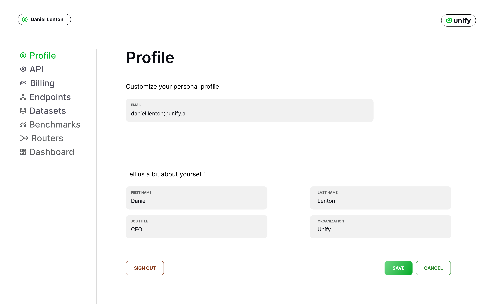
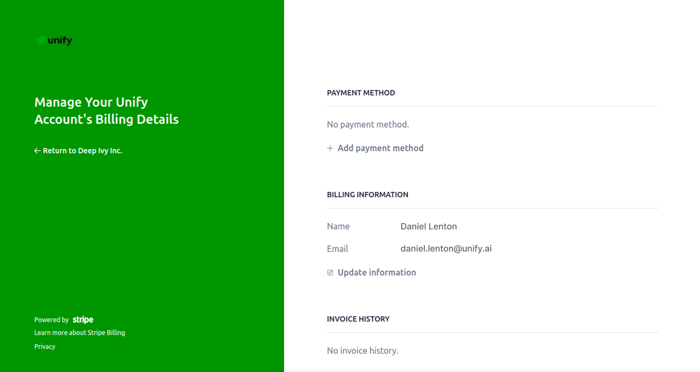
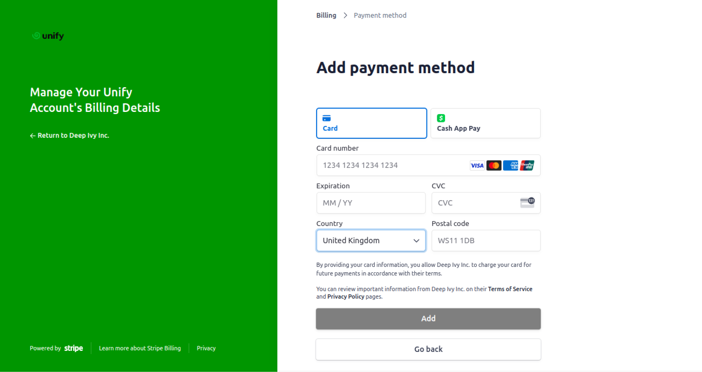
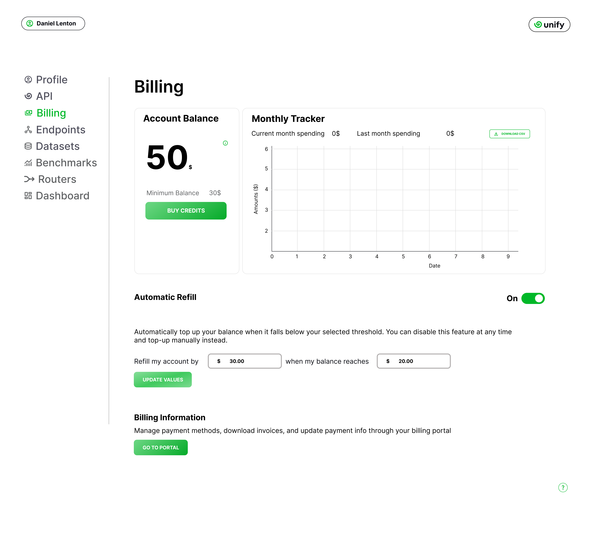
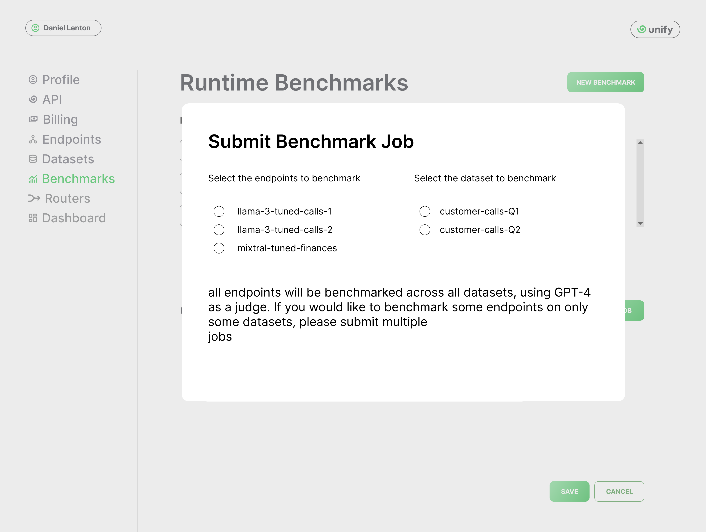
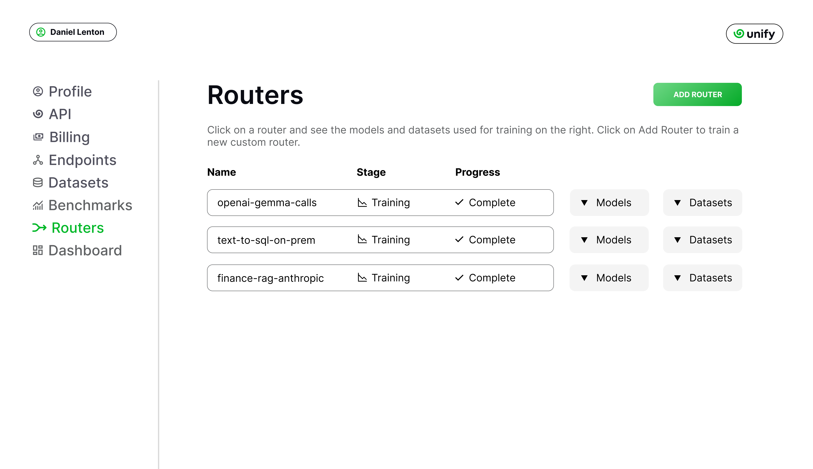

Unify Walkthrough
=================

This section will guide you through the different aspects of the :code:`Unify Console`, and help you get up and running in no time. Feel free to skip any sections which aren't relevant to you.

Creating your profile
---------------------

Depending on the sign-up method you chose, some of the entries in the :code:`Profile` sections will already be populated. Regardless, you can use this page to change your email address, add your personal information, and sign out in case you’d like to use another account.

Using the Unify API
-------------------

When opening the console, you will first be greeted with the :code:`API` page. This is where you'll find your API key which gives you access to all the LLMs available through Unify, as well as the router and the benchmarking API.

You will also find useful links to the documentation and various applications, where you can interact with the endpoints and the benchmarks, in no-code environments.

.. image:: ../images/console_api.png
  :align: center
  :width: 650
  :alt: Console API.

.. note::
    If you suspect your API key was leaked in some way, you can safely regenerate it through this page. You would then only need to replace the old key with the new one in your workflows with the same balance and account settings as before.

Setting up Billing
------------------

The :code:`Billing` page is where you can set-up your payment information to recharge your account, and track your spending. By default, you can only top-up manually by clicking on **Buy Credits**. We recommend you set-up automatic refill to avoid any disruption to your workflows when your credits run out.

.. image:: ../images/console_billing_no_payment.png
  :align: center
  :width: 650
  :alt: Console Billing No Payment.

As specified on the page, activating automatic refill requires you go through the dedicated :code:`Billing Portal`. Going to the :code:`Billing Portal` shows you the screen below where you can add your preferred payment method, update your billing information, and download your invoices.

Clicking on **Add payment method** then lets you introduce your card information.

With your payment information set-up, you can now toggle automatic refill on and off as needed on the main billing page. The automatic refill lets you specify the cut-off amount at which your account is automatically refilled by the specified amount when it reaches it.

.. warning::
    The sections below illustrate some of the planned features we're currently working on. All visuals, metrics and functionalities outlined are only presented for illustrative purposes. As such, **any section marked as Beta is currently not available**. We're constantly iterating on our roadmap so if you'd like to leave some feedback or suggestion on features you'd like to see, `we'd love to discuss <https://calendly.com/daniel-lenton/beta-discussion>`_ this with you!

Adding custom endpoints (Beta)
-----------------------------

Prerequisite
^^^^^^^^^^^^
Firstly, you’ll need to set up your own LLM endpoints. One option is to use off-the-shelf endpoints, such as those available in the `Azure ML Model Catalog <https://learn.microsoft.com/en-us/azure/machine-learning/concept-model-catalog>`_, `Vertex AI Model Garden <https://cloud.google.com/model-garden>`_ and `AWS Bedrock <https://aws.amazon.com/bedrock>`_.

Alternatively, you can create and host your own LLM endpoint. There are a whole variety of ways to do this, but again it’s most common to do so via one of the major cloud providers. Feel free to check out these tutorials for creating custom LLM endpoints on `Azure ML <https://learn.microsoft.com/en-us/azure/machine-learning/how-to-deploy-custom-container>`_, `AWS Bedrock <https://docs.aws.amazon.com/bedrock/latest/userguide/model-customization-use.html>`_ and `Vertex AI <https://cloud.google.com/vertex-ai/docs/predictions/use-custom-container>`_.

Regardless of how you set up your LLM endpoints, it’s important that you expose an API for this, and that this API **adheres to** the `OpenAI standard <https://platform.openai.com/docs/api-reference>`_. This is necessary in order to integrate with Unify. We intended to broaden support to other API formats at a later date.

Adding the endpoints
^^^^^^^^^^^^^^^^^^^^

Once you’ve got your custom LLM endpoints set up, the next step is to add these to the  :code:`Endpoints` section of your :code:`Unify Console`.

.. image:: ../images/console_custom_endpoints.png
  :align: center
  :width: 650
  :alt: Console Custom Endpoints.

That’s it, you now know how to add your own custom keys and custom endpoints! You can query your custom endpoint via the Unify API by specifying **<name>@custom**, with *name* being the model name and *custom* being the provider.

Adding custom datasets (Beta)
-----------------------------

To add a custom dataset, first head to the :code:`Datasets` section of the console. Then, specify a local file to upload, containing the prompts you would like to benchmark on. Then, click the **Add Dataset** button.

.. image:: ../images/console_datasets_start.png
  :align: center
  :width: 650
  :alt: Console Dataset Start.

The resulting screen lets you specify the local :code:`.jsonl` file to upload, based on the specified format.

.. image:: ../images/console_datasets_add.png
  :align: center
  :width: 650
  :alt: Console Dataset Add.

Once your dataset is uploaded, you can click on the dataset and view it in the preview section.

.. image:: ../images/console_datasets_preview.png
  :align: center
  :width: 650
  :alt: Console Dataset Preview.

.. note::
    Datasets do not contain train, validation and test splits internally. If you would like to upload training, validation and test splits for a dataset, then these should each be uploaded and named independently. In the future, we plan to enable grouping datasets together and creating folder structures etc.

That’s it, you now know how to add your own custom keys and custom endpoints!

Running benchmarks on your custom datasets (Beta)
-------------------------------------------------

To open up the benchmarking interface, first click on :code:`Benchmarks`.

Runtime Benchmarks
^^^^^^^^^^^^^^^^^^
In the benchmarks page, you can see all of the current and previous benchmark jobs you triggered, and you can also specify which endpoints you would like to include for runtime benchmarking.

If you have various private endpoints deployed across various servers, each with varying latencies, it can be useful to track these speeds across time, to ensure you’re always sending your requests to the fastest servers.

To trigger periodic runtime benchmarking for a custom endpoint, simply add it to the list under the heading **Runtime Benchmarks**. You also need to specify at least one IP address from where you would like to test this endpoint, and also at least one prompt dataset against which you would like to perform the benchmarking.

.. image:: ../images/console_runtime_benchmarks.png
  :align: center
  :width: 650
  :alt: Console Runtime Benchmarks.

Once all endpoints are added, you can then go to the `Benchmarks <https://unify.ai/benchmarks>_` page, and you’ll find your model listed. Note the **lock icon**, which indicates that this benchmark is private (only accessible from your own account).

.. image:: ../images/custom_benchmarks.png
  :align: center
  :width: 650
  :alt: Custom Benchmarks.

You can open up the benchmark page like any other endpoint, and view the performance for various metrics plotted across time.

.. image:: ../images/custom_benchmarks_model.png
  :align: center
  :width: 650
  :alt: Custom Benchmarks Model.

That’s it! You now know how to set up periodic benchmarking for your custom endpoints. If you have several versions of the same model, you can use options such as :code:`lowest-itl`, explained `here <https://unify.ai/docs/concepts/runtime_routing.html#available-modes>`_, to route to the faster deployment based on the latest benchmarking data. 

We’ll next explore how to run quality benchmarks.

Quality benchmarks
^^^^^^^^^^^^^^^^^^

This time, going to to the **Quality Benchmarks** subsection. We can click on **SUBMIT JOB** to trigger a new quality benchmark run.

You need to specify the endpoints and the datasets you would like to benchmark. All endpoints will be tested on all datasets. If you only want to test some endpoints on some datasets, then you should submit multiple jobs.

Once you are happy with the selection, press **Submit** and then the job will appear in the **Running Jobs** section, as shown below.

.. image:: ../images/console_benchmarks_quality_submitted.png
  :align: center
  :width: 650
  :alt: Console Benchmarks Quality Submitted.

The job can be expanded, to see each endpoint and dataset pair, and check the progress.

.. image:: ../images/console_benchmarks_quality_jobs.png
  :align: center
  :width: 650
  :alt: Console Benchmarks Quality Quality Jobs.

The entire history of benchmarking jobs can also be viewed by clicking on **History**, like so.

.. image:: ../images/console_benchmarks_quality_history.png
  :align: center
  :width: 650
  :alt: Console Benchmarks Quality History.

That’s it, you now know how to submit quality benchmarking jobs! In the next section, we’ll explain how to visualize these benchmarking results.

Visualize Benchmark Results (Beta)
----------------------------------

Once the benchmarking is complete, we can then visualize the benchmarking results in the dashboard. First, click :code:`Dashboard` on the left hand pane.

By default, all endpoints will be plotted on the :code:`Open Hermes` dataset, and the default foundation router will also be plotted, with various configurations of this router plotted as stars.

.. image:: ../images/console_dashboard.png
  :align: center
  :width: 650
  :alt: Console Dashboard.

On the dataset dropdown at the top, you can select any dataset of prompts to benchmark each model and provider against in the graph. 

.. image:: ../images/console_dashboard_dataset.png
  :align: center
  :width: 650
  :alt: Console Dashboard Dataset.

When clicked, the scatter graph will be replotted, on your own custom prompts in your dataset. If no quality benchmarks have been run, then the scatter graph will be empty. In this case, let's plot the benchmarks for the custom dataset **Customer Calls 1**.

.. image:: ../images/console_dashboard_custom_dataset.png
  :align: center
  :width: 650
  :alt: Console Dashboard Custom Dataset.

We can see that the custom endpoints :code:`mixtral-tuned-finances`, :code:`llama-3-tuned-calls1` and :code:`llama-3-tuned-calls2` are plotted, alongside the foundation router, which is always plotted by default. If there is a model not plotted, but you would like it to be, then you can simply head over to the :code:`Benchmarks` page and trigger a quality benchmark job. Once the job completes, the model will then be visible in this dashboard.

Let’s return to the default view of all models and providers plotted on the :code:`Open Hermes` dataset. We can change the metric plotted on the x axis from cost to something else, by clicking **Metric**. This will let us plot the score against time-to-first-token (TTFT) for e.g.

.. image:: ../images/console_dashboard_metric.png
  :align: center
  :width: 650
  :alt: Console Dashboard Metric.

You can remove any of these points by simply clicking on the model names on the key to the right of the graph. That model will then be removed from the graph, and the router points will be updated.

.. image:: ../images/console_dashboard_filtered.png
  :align: center
  :width: 650
  :alt: Console Dashboard Filtered.

That’s it! You now know how to visualize benchmark results across different models and providers on different datasets, including your own custom endpoints on your own custom datasets.

Train a custom router (Beta)
----------------------------

Going to the :code:`Routers` page, we can click on any router and see the models it was trained to route between and the datasets used for training, both on the right hand side.

To add a new router, first click **Add Router**. The upload window enables you to name the router, and specify the endpoints to route between and datasets to train on.
We'll name the router :code:`gpt4-llama3-calls`, as we intend to train on our custom call datasets and use GPT4 as well as the base llama3 and our fine tuned variants.

The models are those which the router will be able to select between, and the datasets will be used as the input prompts to the router system to train which models to use, based on the quality of the output, with GPT4-as-a-judge responsible for the scoring. You can select the included models and / or datasetsfrom the corresponding dropdowns. Your custom model endpoints and datasets are included in the lists.

.. image:: ../images/console_routers_train.png
  :align: center
  :width: 650
  :alt: Console Routers Train.

.. note::
    You can notice that the endpoint providers are not listed. This is because the router training does not depend on the provider, only the model.

Finally, clicking the **Train** button will submit a training job! Your router configuration will be grayed out while the training is being performed. While the benchmarks are being performed.

.. image:: ../images/console_routers_benchmarking.png
  :align: center
  :width: 650
  :alt: Console Routers Benchmarking.

In order to train a router, it’s necessary to first evaluate the performance of each model on each prompt in each dataset. This is exactly what happens when we submit quality benchmarks as explained in the quality benchmarking section above. 

If you go to the **Benchmarks** page, you’ll see that the router training job has automatically scheduled some quality benchmarks on your behalf. For any quality benchmarks which have already been performed ahead of time, the work will not be duplicated.

For example, we previously benchmarked :code:`llama-3-tuned-calls1` and :code:`llama-3-tuned-call2` on the datasets :code:`customer-calls1` and :code:`customer-calls2`, so this will not be repeated (see above). However, we have not yet benchmarked :code:`llama-3-70b-chat` and :code:`gpt-4` on these datasets, so these are automatically triggered by the router training request.

.. note::
    You will receive an email, so no need to manually track the progress!

With the benchmarks done, the router training is then triggered, and the status of your router is updated accordingly.

.. image:: ../images/console_routers_training.png
  :align: center
  :width: 650
  :alt: Console Routers Training.

Once the router training is complete, you will receive a second email. The router is ready to be deployed, and is ready to be visualized on the dashboard tab for selecting the best configuration of the router (see next section).

That’s it, you’ve now trained your own custom router, to route between your own custom models, trained directly on your own prompt data, to reflect the task you care about!

Deploy your custom router (Beta)
-------------------------------

Now that we have a custom trained router, the next step is to explore the various possible configurations for this router, each trading off quality, speed and cost in different variations. These various options can be visualized in the **Dashboard**.

As before, we first choose the dataset to benchmark on. We will choose the custom dataset **Customer Calls 1**.

After selecting the dataset, all data points which have been benchmarked on this dataset will automatically be plotted, which now also includes the custom trained router.

.. image:: ../images/console_dashboard_custom_router_plotting.png
  :align: center
  :width: 650
  :alt: Console Dashboard Custom Router Plotting.

The base router and all custom routers can also be further configured, by clicking on **Router**, and then clicking on the router which you’d like to customize.

.. image:: ../images/console_dashboard_router.png
  :align: center
  :width: 650
  :alt: Console Dashboard Router.

Then, the following window appears, from where a router view can be created. A router view takes a router and constrains the search space in some way. This can be useful if you only have access to certain models or providers in the deployment environment, or if you want to ensure each model routed to is guaranteed to meet certain quality and performance requirements.

.. image:: ../images/console_dashboard_custom_view.png
  :align: center
  :width: 650
  :alt: Console Dashboard Custom View.

Of course, only the models the router has been trained on will be visible in the dropdown. However, you can remove some of these models from the search space. Let's presume we don’t want to use anthropic models, as we don’t have them properly configured to run in our deployment environment yet.

We don’t want to save the router view to our account, we’re only testing at the moment. We therefore click **Apply**.

.. note::
    Alternatively, if we had clicked **Save** then it would have simply overwritten the router :code:`openai-llama3-calls` in place, again limited to this dashboard   session only.

In the key, the router view is displayed nested underneath the router which it is a view of.

.. image:: ../images/console_dashboard_no_anthropic.png
  :align: center
  :width: 650
  :alt: Console Dashboard No Anthropic.

We can see that removing the anthropic models slightly reduced the performance of the router, but not by a noticeable amount. Let’s assume we decide to stick with this decision, to avoid the need to set up Anthropic in our deployment environment in the immediate future.

The next task is to choose the data point which best balances quality, speed and cost for our application. If a point is selected, its details will appear below the legend. Details include the full id of the configuration, as well as the endpoints it routes to with the routing frequency per endpoint.

.. image:: ../images/console_dashboard_custom_selected.png
  :align: center
  :width: 650
  :alt: Console Dashboard Custom Selected.

We select a data point that looks balanced. We can see that this router configuration makes use of :code:`gpt4` 42% of the time, :code:`llama-3-tuned-calls1` 29% of the time, :code:`llama-3-tuned-calls2` 18% of the time, and :code:`llama-3-70b-chat` 11% of the time.

.. note::
    Once the point is selected, that same selected point will be visible across all three graphs, with x axes for cost, inter-token-latency and time-to-first-token, so that any specific router configuration can be thoroughly examined across all metrics of importance.

As with the router views, we can save this router configuration either to the dashboard session, or to our user account. Let’s assume we’re very happy with this configuration, and we don’t want to forget it. We’ll therefore save it to our account, by clicking **Save As**

.. image:: ../images/console_dashboard_custom_configuration.png
  :align: center
  :width: 650
  :alt: Console Dashboard Custom Selected.

.. note::
    This router configuration depends on the router view **openai-llama3-calls->no-anthropic**, which has not yet been saved to the account. We are therefore informed that this will also save the router view to the account.

Once saved, the new router view and router configuration are then both visible from the **Routers** page of your account. You can delete router views and router configurations anytime from that page. Pressing the copy button beside the configuration will copy the full configuration to the clipboard, being :code:`gpt4-llama3-calls->no-anthropic_8.28e-03_4.66e-0.4_1.00e-06@unify`.

.. image:: ../images/console_routers_configurations_views.png
  :align: center
  :width: 650
  :alt: Console Routers Configurations Views.

.. note::
    You can also copy the configuration from the dashboard which will now show it (along with the parent view) by default.

With the configuration copied to the clipboard, all you now need to do is pass this into the Unify instructor if using the Python client, like so:

.. code-block:: python

    import os
    from unify import Unify

    unify = Unify(
        api_key=os.environ.get("UNIFY_KEY"),
        endpoint="openai-llama3-calls->no-anthropic_8.28e-03_4.66e-0.4_1.00e-06@unify”",
    )

    response = unify.generate(user_prompt="Explain who Newton was and his entire theory of gravitation. Give a long detailed response please and explain all of his achievements")

.. note::
    You can also query the API with a CuRL request, among others. For more details head to the next section to learn how you can make your first request.

That’s it! You now know how to explore the various configurations of your custom trained router, and get it deployed in your own application.
