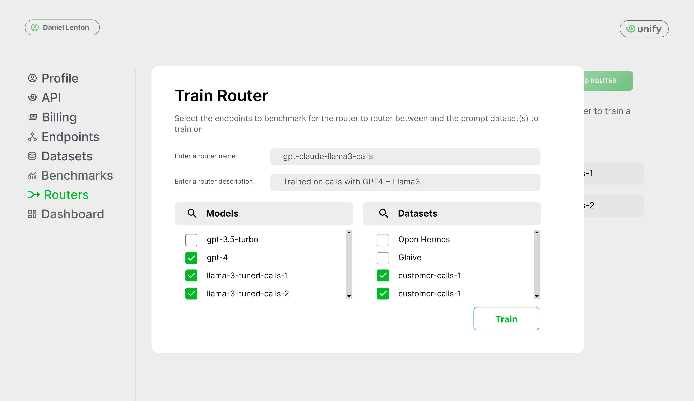
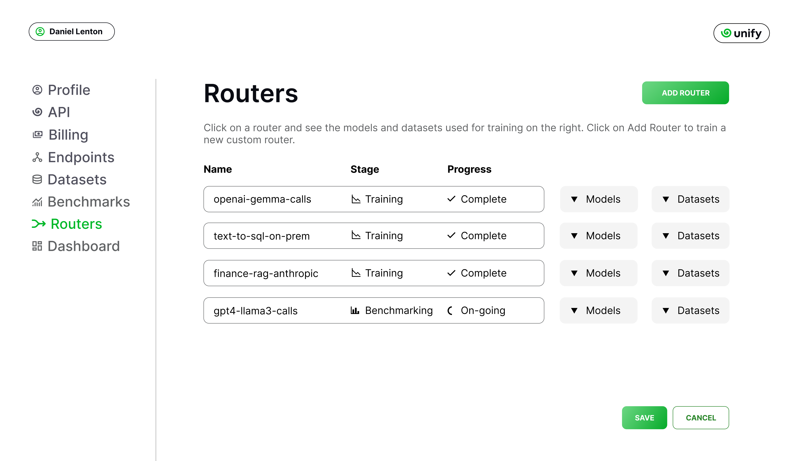
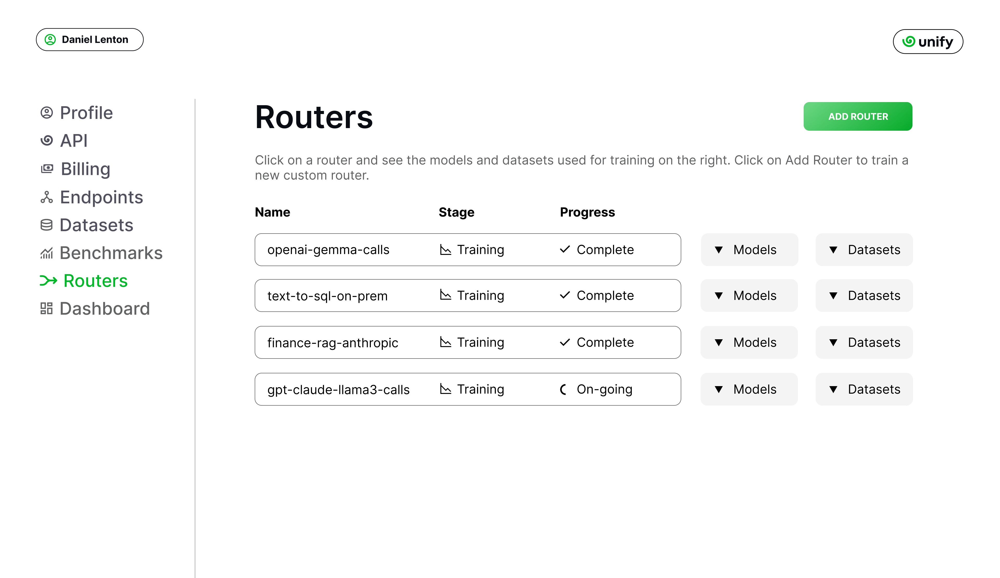
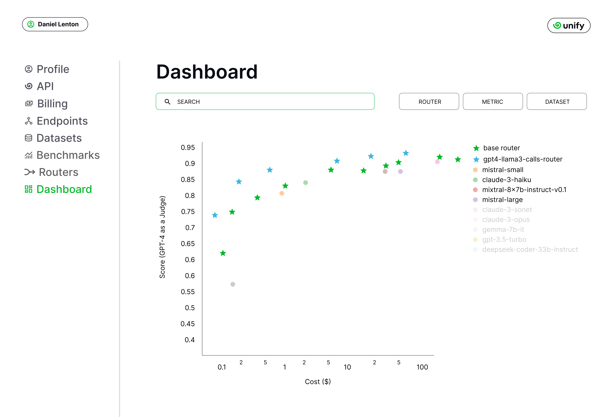
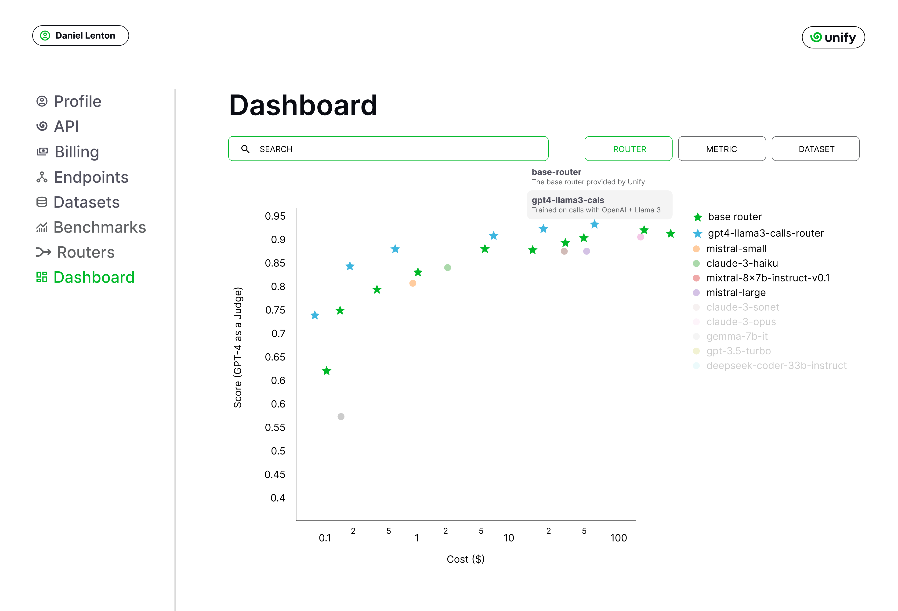
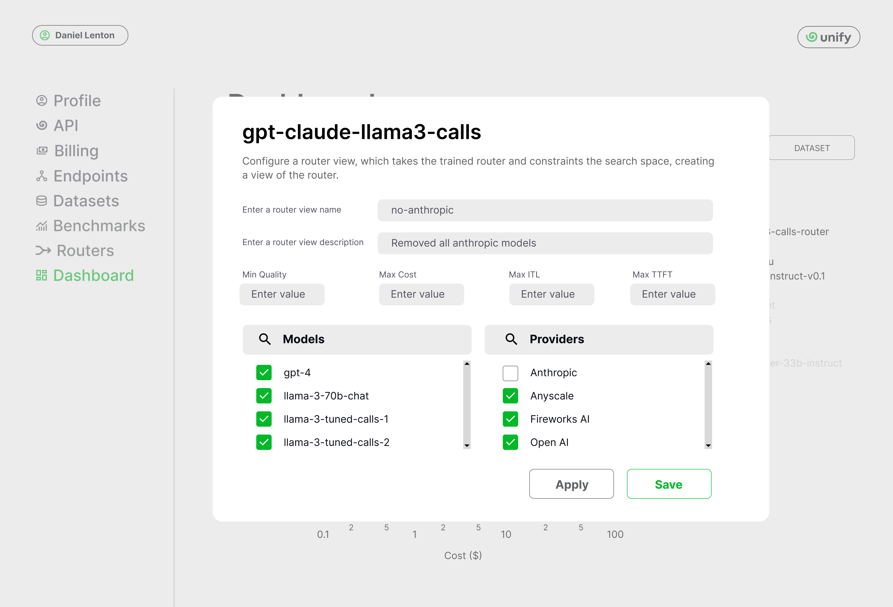
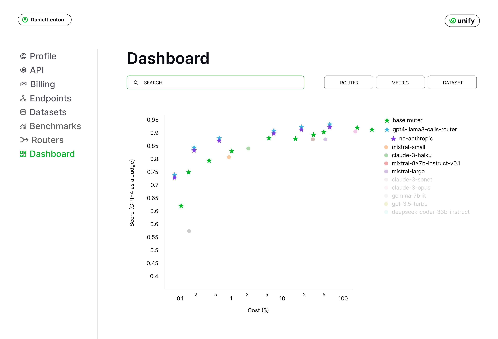
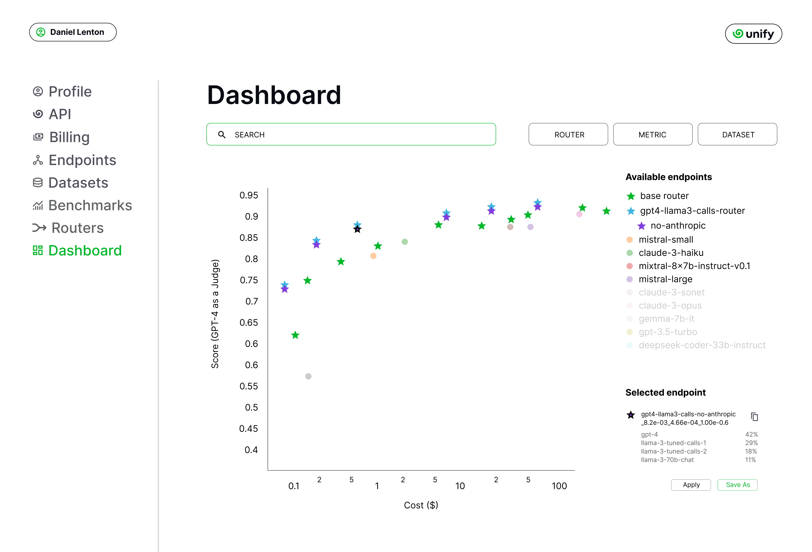
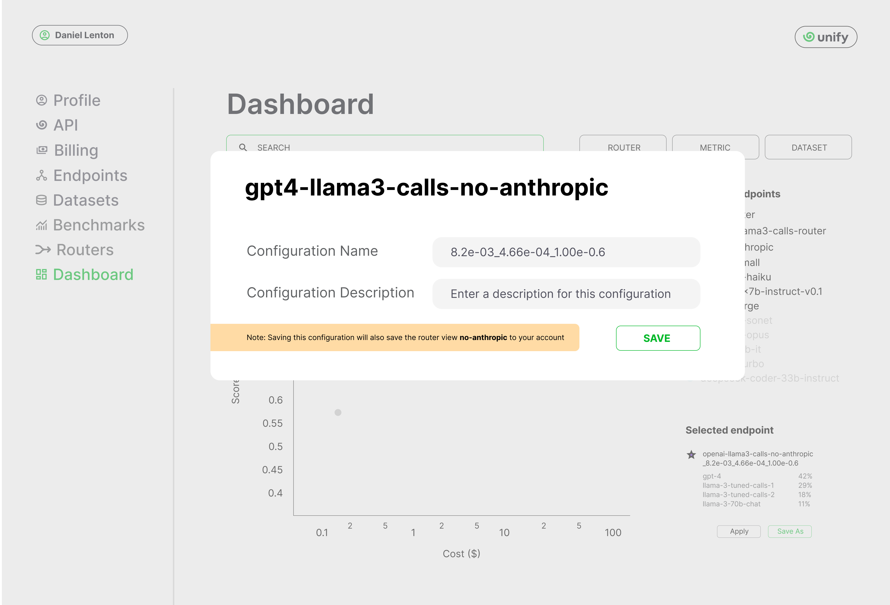
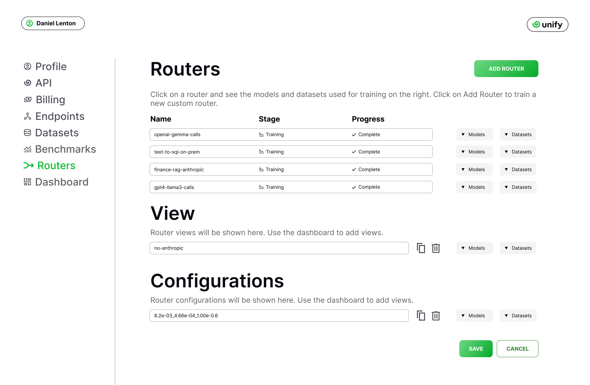

Building a custom router
========================

In this section, you'll learn how to train and customize a router through the console.

Training a custom router
------------------------

Going to the :code:`Routers` page, you can add a new router by first clicking on :code:`Add Router`. The upload window enables you to name the router, and specify the endpoints to route between and datasets to train on.

For this example, we'll name our router :code:`gpt-claude-llama3-calls`, as we intend to train on the custom call datasets we uploaded earlier and use GPT 4 as well as Claude 3, the base Llama 3 model, and our fine tuned variants as endpoints.

.. note::
    You can learn how to add a custom endpoint and dataset `here <https://unify.ai/docs/interfaces/connecting_stack.html>`_ 

You can select the included models and / or datasets from the corresponding dropdowns. Your custom model endpoints and datasets will be included in the lists.

.. note::
    You may notice that the endpoint providers are not listed. This is because the router training does not depend on the provider, only the model.

Finally, clicking the :code:`Train` button will submit a training job. Your router configuration will be grayed out during the benchmarking and training processes.

If you go to the :code:`Benchmarks` page, you’ll see that the router training job has automatically scheduled some quality benchmarks on your behalf. For any quality benchmarks which have already been performed ahead of time, the work will not be duplicated.

For example, we previously benchmarked :code:`llama-3-tuned-calls1` and :code:`llama-3-tuned-call2` on the datasets :code:`customer-calls1` and :code:`customer-calls2`, so this will not be repeated. However, we have not yet benchmarked :code:`llama-3-70b-chat` and :code:`gpt-4` on these datasets for e.g, so these are automatically triggered by the router training request.

.. note::
    You will receive an email when the results are ready, so no need to manually track the progress!

With the benchmarks done, the router is moved to the training stage and, accordingly, training is triggered.

Once the router training is complete, you will receive a second email. The router performance can now be visualized on the :code:`Dashboard` page.

Customizing your router
-----------------------

Now that we have a trained router, the next step is to explore the various possible configurations for this router, each trading off quality, speed and cost in different variations. These various options can be visualized in the :code:`Dashboard`.

As before, we first choose the dataset to benchmark on. After selecting the dataset, all data points which have been benchmarked on this dataset will automatically be plotted, including the custom router.

The base router and all custom routers can be further configured, by clicking on :code:`Router`, and then clicking on the router which you’d like to customize.

The next window allows you to create a router view. A router view takes a router and constrains the search space in some way. This can be useful if you only have access to certain models or providers in the deployment environment, or if you want to ensure each model routed to is guaranteed to meet certain quality and performance requirements.

Of course, only the models the router has been trained on will be visible in the dropdown. However, you can remove some of these models from the search space. Let's presume we don’t want to use Anthropic models, as we don’t have them properly configured to run in our deployment environment yet.

We don’t want to save the router view to our account, we’re only testing at the moment. We therefore click :code:`Apply`.

.. note::
    Alternatively, had we clicked on :code:`Save`, this would have overwritten the :code:`gpt-clauce-llama3-calls` router in place.

In the legend, the router view is displayed underneath its parent router.

We can see that removing the Anthropic models slightly reduced the performance of the router, but not by a noticeable amount. Let’s assume we decide to stick with this decision, to avoid the need to set up Anthropic in our deployment environment in the immediate future.

The next task is to choose the data point which best balances quality, speed and cost for our application. If a point is selected, its details will appear below the legend. Details include the full Id of the configuration, as well as the routing frequency per endpoint on this dataset

We select a data point that looks balanced. We can see that, on this dataset, this router configuration makes use of :code:`gpt4` 42% of the time, :code:`llama-3-tuned-calls1` 29% of the time, :code:`llama-3-tuned-calls2` 18% of the time, and :code:`llama-3-70b-chat` 11% of the time.

.. note::
    Once the point is selected, that same point will be visible across all metrics graphs, with x axes for cost, inter-token-latency and time-to-first-token. This lets you verify how the configuration performs for other metrics.

As with the router views, we can either save this router configuration for the current session by clicking on :code:`Apply`, or permanently to our user account. Let’s assume we’re very happy with this configuration, and we don’t want to forget it. We’ll therefore save it to our account by clicking :code:`Save As`. This opens a window where we can change the name our configuration before saving it.

.. note::
    This router configuration depends on the router view :code:`gpt-claude-llama3-calls->no-anthropic`, which has not yet been saved to the account. We are therefore informed that this will also save the router view to the account.

Once saved, the new router view and router configuration are then both visible on the :code:`Routers` page of your account. You can delete views and configurations anytime from that page. Pressing the copy button beside the configuration will copy the full configuration to the clipboard, in this case :code:`gpt-claude-llama3-calls->no-anthropic_8.28e-03_4.66e-0.4_1.00e-06@unify`.

.. note::
    You can also copy the configuration from the dashboard which will now show it (along with the parent view) by default.

Round Up
--------

That’s it! You have now trained your first custom router, ready to be used through our API. You can now `deploy it <https://unify.aid/docs/api/deploy_router.html>`_, or learn `how to query endpoints <https://unify.ai/docs/api/first_request.html>`_ first.
