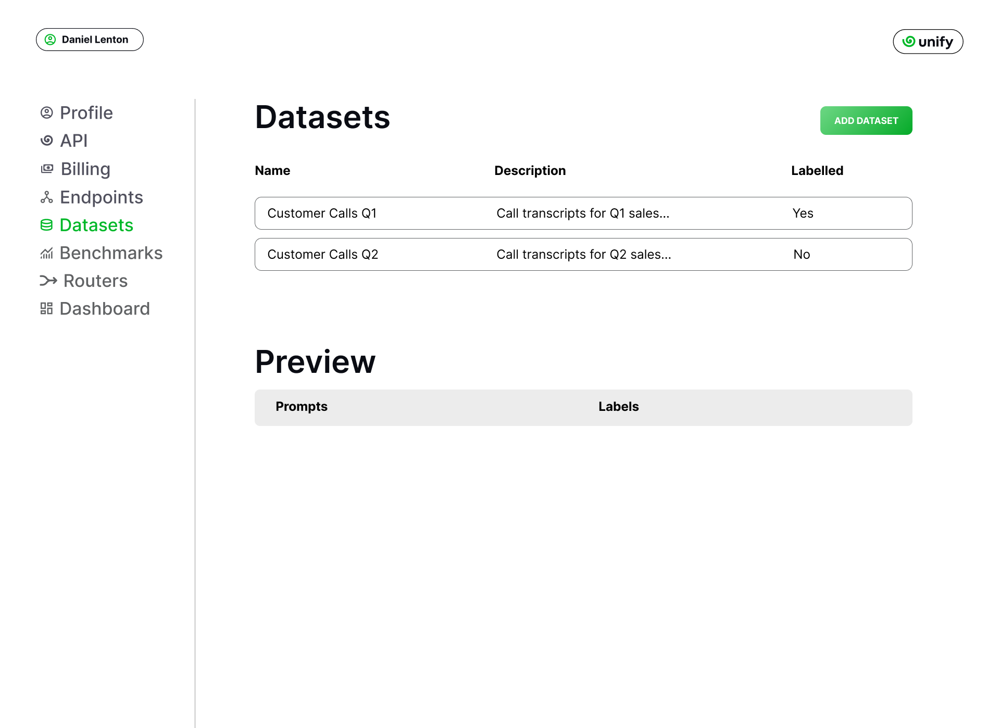
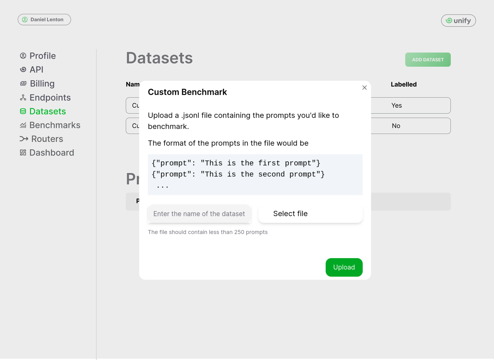
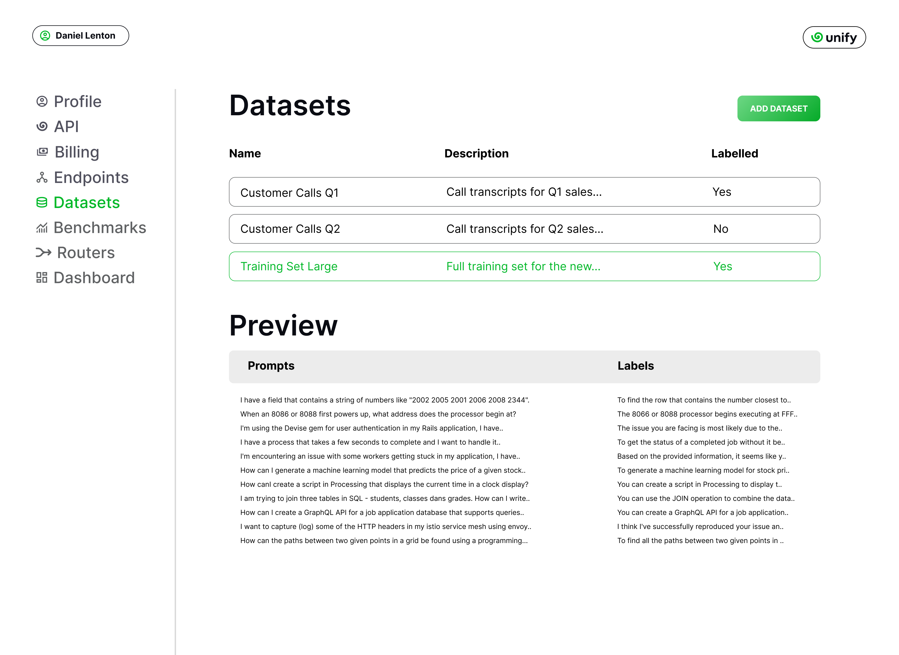

Connecting your stack
=====================

In this section, you'll learn how to add your own endpoints and datasets to the console.

Custom endpoints
----------------

Prerequisite
^^^^^^^^^^^^
In this section, we'll assume you have already set up your own LLM endpoints. 

If not, one option is to use off-the-shelf endpoints, such as those available in the `Azure ML Model Catalog <https://learn.microsoft.com/en-us/azure/machine-learning/concept-model-catalog>`_, `Vertex AI Model Garden <https://cloud.google.com/model-garden>`_ and `AWS Bedrock <https://aws.amazon.com/bedrock>`_. Alternatively, you can create and host your own LLM endpoint. There are a whole variety of ways to do this, but again it’s most common to do so via one of the major cloud providers.

Regardless of how you set up your LLM endpoints, you'll need to expose an API for this. The API should also **adhere to** the `OpenAI standard <https://platform.openai.com/docs/api-reference>`_ to integrate with Unify.

Adding the endpoints
^^^^^^^^^^^^^^^^^^^^

Once you’ve got your custom LLM endpoints set up, the next step is to add these to the :code:`Endpoints` section of the console. 

Click on :code:`Add Endpoint` to upload a new endpoint. You'll have to specify a name, and the cloud provider used for the endpoint. You will also need to include your API key for said provider so we can query your endpoint on your behalf.

.. image:: ../images/console_custom_endpoints.png
  :align: center
  :width: 650
  :alt: Console Custom Endpoints.

That's all! Your custom endpoints are now available through the Unify API as well as our interfaces, ready to be benchmarked and routed across.

Custom datasets
---------------

You can add a dataset on the :code:`Datasets` section of the console. There, click the **Add Dataset** button.

The resulting screen lets you specify the local :code:`.jsonl` file to upload, containing the prompts you would like to benchmark on.

Note that the screen above is only for unlabelled datasets, which works fine to benchmark endpoints. If you want to train a custom router then you'll need to upload a list of prompts along with reference answers.

Once your dataset is uploaded, you can click on it to preview the prompts. For example, the image below shows the preview for a labelled dataset.

Round Up
--------

That’s it, you now know how to upload your own endpoints and datasets! You can now `run custom benchmarks <https://unify.ai/docs/interfaces/running_benchmarks.html>`_, `build a custom router <https://unify.ai/docs/interfaces/build_router.html>`_, or `query your endpoint <https://unify.ai/docs/api/first_request.html>`_ with the Unify API. 