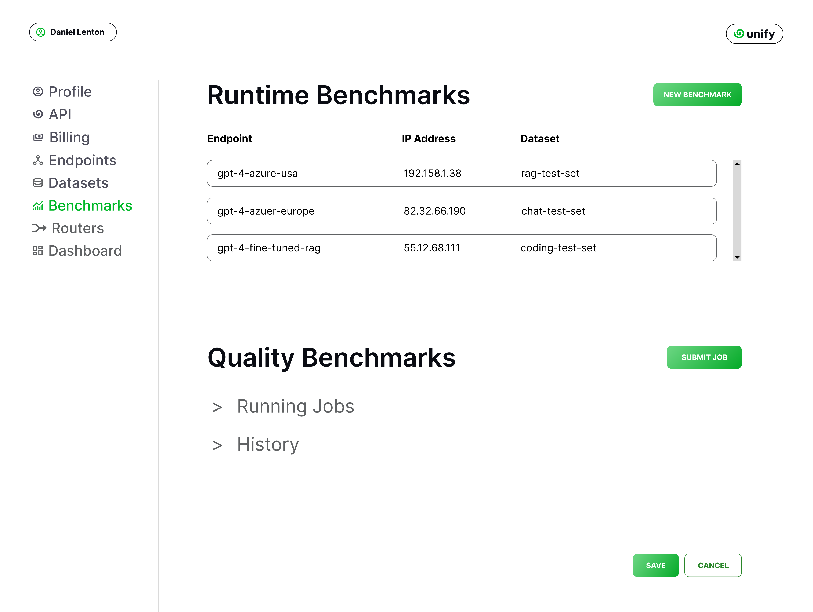
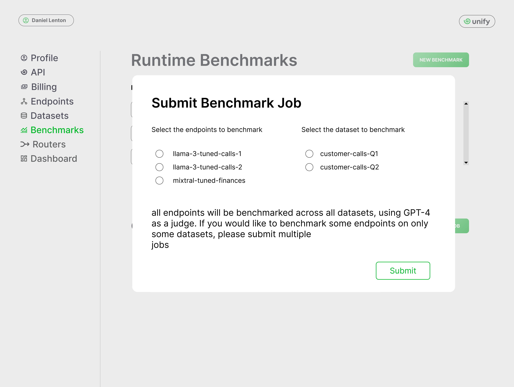
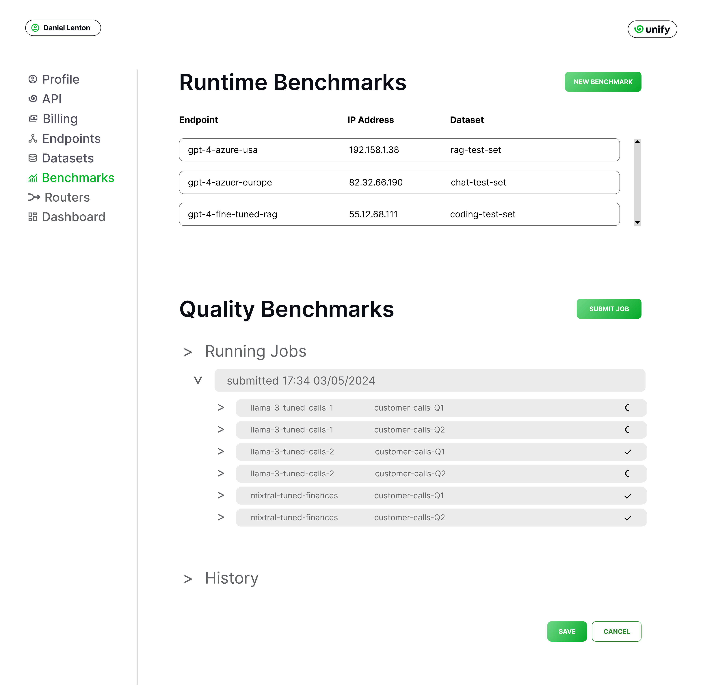

Benchmarking endpoints
======================

In this section, you'll learn explore how to navigate our benchmarks and run your own custom ones.

.. note::
    You can learn about the methodology behind our benchmarks, and the various metrics used, on the `benchmarks design <https://unify.ai/docs/concepts/benchmarks.html>`_ section.

Quality benchmarks
------------------

To compare the quality of different LLMs, you head to the :code:`Dashboard` page on the console.

By default, all endpoints will be plotted on six datasets, with the :code:`OpenHermes` dataset shown first. The default router will also be plotted, with various configurations of this router plotted as stars.

.. image:: ../images/console_dashboard.png
  :align: center
  :width: 650
  :alt: Console Dashboard.

On the dataset dropdown at the top, you can select any dataset of prompts to benchmark each model and provider against. The scatter graph will then be replotted for the selected dataset.

.. image:: ../images/console_dashboard_dataset.png
  :align: center
  :width: 650
  :alt: Console Dashboard Dataset.

Similarily, you can change the metric plotted on the x axis from cost to something else, by clicking on the :code:`Metric` dropdown. This will let us plot the score against time-to-first-token (TTFT) for e.g.

.. image:: ../images/console_dashboard_metric.png
  :align: center
  :width: 650
  :alt: Console Dashboard Metric.

You can remove any of these points by simply clicking on the model names on the legend. That model will then be removed from the graph, and the router points will be updated to only account for the remaining endpoints.

.. image:: ../images/console_dashboard_filtered.png
  :align: center
  :width: 650
  :alt: Console Dashboard Filtered.

Runtime benchmarks
------------------

The benchmarks displayed on the console allow you to compare the average quality and runtime performance of LLM endpoints. As explained on the `benchmarks design <https://unify.ai/docs/concepts/benchmarks.html>`_ section, runtime metrics tend to change over time.

For granular runtime benchmarks, head to the `benchmarks interface <https://unify.ai/benchmarks>`_ outside of the console. There, you can find a list of popular LLM endpoints, periodically updated with new models and providers.

.. image:: ../images/benchmarks_main.png
  :align: center
  :width: 650
  :alt: Benchmarks Page.

Each page contains a suite of runtime benchmarks providing timely information on the speed, cost and latency of the endpoints exposed by different endpoint providers. 

.. note::
    You can learn more about endpoints providers on the dedicated `endpoints <https://unify.ai/docs/concepts/benchmarks.html>`_ section

For e.g, the image below corresponds to the benchmark page for :code:`mistral-7b-instruct-v0.2`.

.. image:: ../images/benchmarks_model_page.png
  :align: center
  :width: 650
  :alt: Benchmarks Model Page.

The plot displays the changing value of the metric selected on the table for the region and sequence length specified, across time and providers. On the other hand, the table displays the latest values for all metrics across providers, and allows you to sort them by metric.  

You can plot a different metric on the graph by clicking on the graph icon next metric's column label. For e.g, the image below shows how the plot for :code:`TTFT` reveals different performance patterns than the default :code:`Output Tokens / Sec` figure.

.. image:: ../images/benchmarks_model_page_changed_setup.png
  :align: center
  :width: 650
  :alt: Benchmarks Model Page TTFT.

Running your own benchmarks (Beta)
----------------------------------

If you are using custom endpoints or need to compare endpoints for a specific task, you can customize the benchmarks to fit your needs. 

.. note::
    If you haven't done so, we recommend you learn how you can `add your own datasets and endpoints <https://unify.ai/docs/interfaces/connecting_stack.html>`_ to the console before resuming. 

Once you've added your endpoints and / or datasets, head to the :code:`Benchmarks` page on the console. There, you can see all of the current and previous benchmark jobs you triggered, and you can also specify which endpoints you would like to include for benchmarking.

Runtime benchmarks
^^^^^^^^^^^^^^^^^^

If you have various private endpoints deployed across various servers, each with varying latencies, it can be useful to track these speeds across time, to ensure you’re always sending your requests to the fastest servers.

To trigger periodic runtime benchmarking for a custom endpoint, simply add it to the list under :code:`Runtime Benchmarks`. You also need to specify at least one IP address from where you would like to test this endpoint, and also at least one prompt dataset against which you would like to perform the benchmarking.

Once all endpoints are added, you can then go to the `benchmarks interface <https://unify.ai/benchmarks>`_ where you’ll find your model listed with a lock icon, indicating that the benchmark is private (only accessible from your account). 

.. image:: ../images/custom_benchmarks.png
  :align: center
  :width: 650
  :alt: Custom Benchmarks.

You can then open the benchmark page like with any other model, and view the performance for various metrics plotted across time.

.. image:: ../images/custom_benchmarks_model.png
  :align: center
  :width: 650
  :alt: Custom Benchmarks Model.

Quality benchmarks
^^^^^^^^^^^^^^^^^^

In order to train a router, or just compare the quality of endpoints, it’s necessary to first evaluate the performance of each model on each prompt of a dataset.

On the :code:`Quality Benchmarks` subsection. You can click on :code:`Submit Job` to trigger a new benchmark comparing the output quality across different LLMs.

You need to specify the endpoints and datasets you would like to benchmark. 

.. note::
  All selected endpoints will be tested on all selected datasets. So, if you only want to test some endpoints on some datasets, then you should submit separate jobs.

Once you are happy with the selection, press :code:`Submit` and the job will appear under :code:`Running Jobs`, as shown below.

.. image:: ../images/console_benchmarks_quality_submitted.png
  :align: center
  :width: 650
  :alt: Console Benchmarks Quality Submitted.

The job can be expanded, to see each endpoint and dataset pair, and check the progress.

The entire history of benchmarking jobs can also be viewed by clicking on :code:`History`, like so.

.. image:: ../images/console_benchmarks_quality_history.png
  :align: center
  :width: 650
  :alt: Console Benchmarks Quality History.

Once the benchmarking is complete, you can visualize the results in the :code:`Dashboard` page. 

Like before, we can select the dataset through the :code:`Dataset` dropdown. In this case, we'll plot the benchmarks for the custom dataset we uploaded.

.. image:: ../images/console_dashboard_custom_dataset.png
  :align: center
  :width: 650
  :alt: Console Dashboard Custom Dataset.

We can see that the custom endpoints :code:`mixtral-tuned-finances`, :code:`llama-3-tuned-calls1` and :code:`llama-3-tuned-calls2` we added earlier are all plotted, alongside the foundation router, which is always plotted by default.

Round Up
--------

That’s it! You now know how to compare LLM endpoints on quality and runtime metrics, and run benchmarks on your own endpoints and datasets. In the next section, we'll learn how to train and deploy a custom router.
